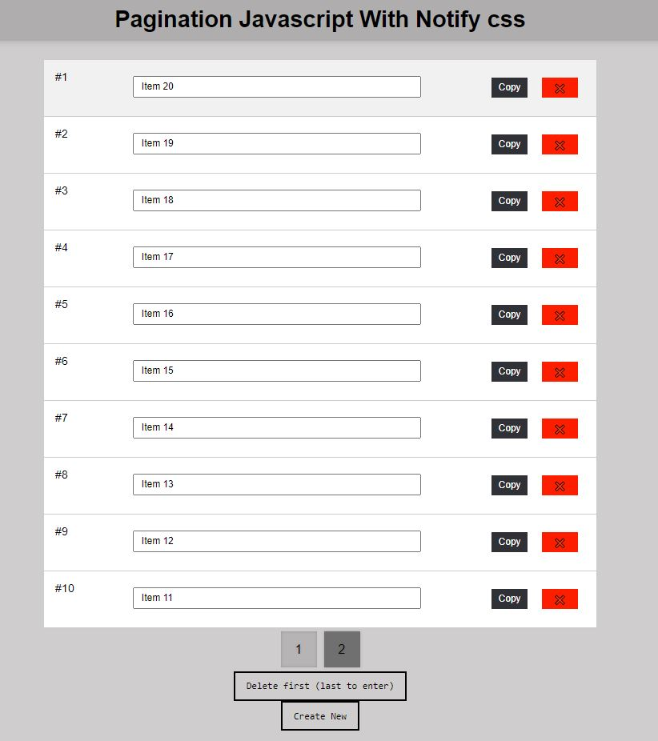
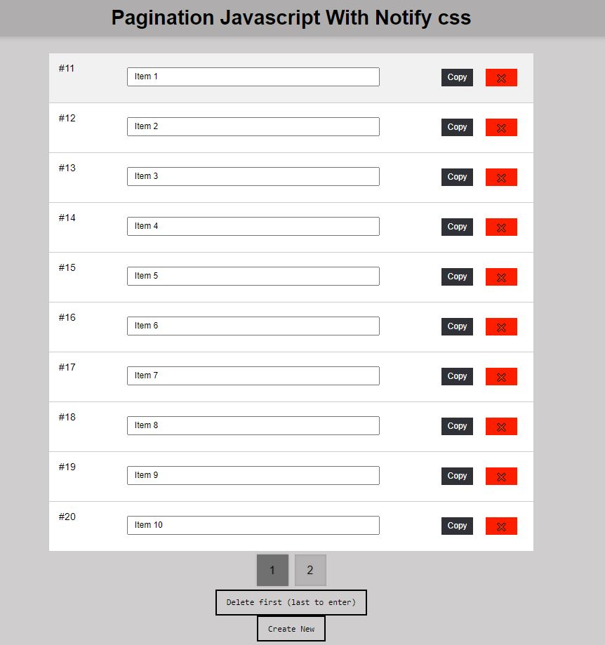
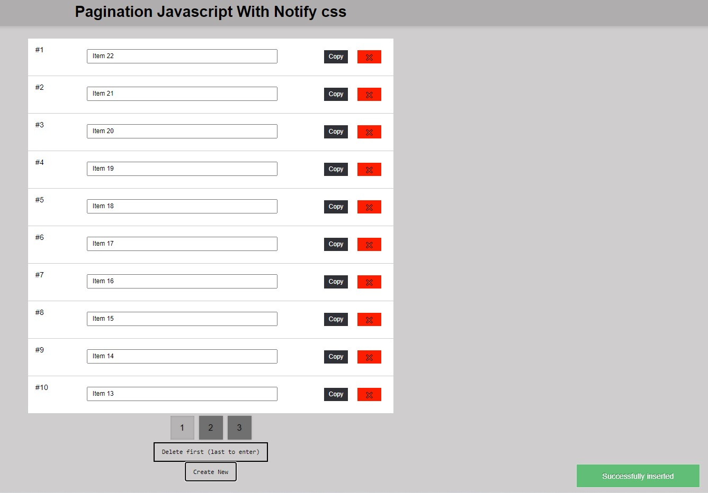
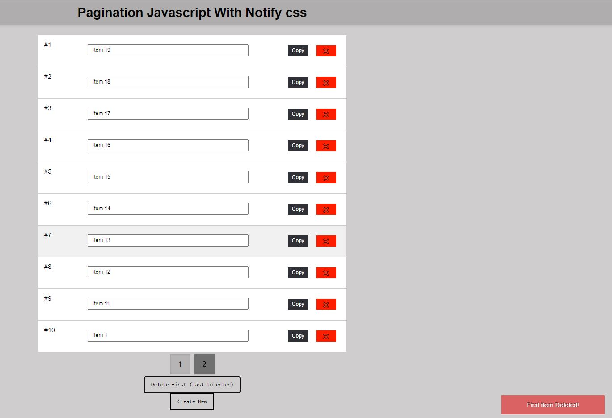

# Javascript pagination with notification css
Simple page pagination with javascript (insert, delete) and notification with css, LIFO (last in, first out)

#

# Images:

Home (page01): 

Home (page01): 

Insert notification css: 

Delete notification css: 
